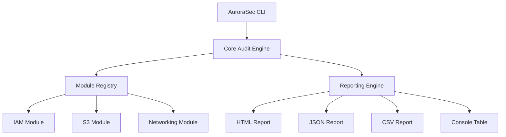

# 🌌 AuroraSec

## Next-Generation AWS Security Auditing & Hardening Engine

[](https://github.com/ismailtsdln/AuroraSec/actions/workflows/main.yml)
<<<<<<< HEAD
[](https://goreportcard.com/report/github.com/ismailtsdln/AuroraSec)
[](https://opensource.org/licenses/MIT)
[](https://github.com/ismailtsdln/AuroraSec)
=======
[](https://opensource.org/licenses/MIT)
>>>>>>> 9bd36f0d19d627eb54a3539e9e2512209b1b6fc2

**AuroraSec** is a high-performance, modular auditing utility designed to provide deep visibility into the security posture of AWS environments. Built with the **AWS SDK for Go v2**, it prioritizes speed, reliability, and actionable intelligence.

---

## 🌟 Why AuroraSec?

In a rapidly evolving cloud landscape, manual security audits are no longer sufficient. AuroraSec bridges the gap between complexity and security by offering:

- **Lightning Fast Audits**: Leveraging Go's concurrency for rapid scanning across multiple services.
- **Modular by Design**: Easily extendable architecture allowing for the addition of custom security modules.
- **Compliance Focused**: Built-in rules that align with AWS Best Practices and CIS Benchmarks.
- **Operational Resilience**: Integrated retry mechanisms and sophisticated error handling for stable execution in large-scale environments.

---

## 🛠️ Key Capabilities

| Feature | Description |
| :--- | :--- |
| 🔒 **IAM Hardening** | Full audit of Root MFA, Account Password Policies, and Access Key health. |
| 📡 **Network Guard** | Continuous monitoring of Security Groups for "wide-open" (0.0.0.0/0) vulnerabilities. |
| 📦 **S3 Sentinel** | Automated validation of Bucket Public Access Blocks and Default Encryption. |
| 📊 **Advanced Echo** | Multi-format reporting including **Interactive HTML**, **JSON**, **CSV**, and **CLI Tables**. |
| 🏹 **Ready for CI/CD** | Native support for automated pipelines with exit-code based triggers. |

---

## 🏗️ Modular Architecture

AuroraSec is designed around a plugin-style architecture where the core engine orchestrates independent security modules.



---

## 🚀 Getting Started

### Installation

#### Install via Go (Recommended)

```bash
go install github.com/ismailtsdln/AuroraSec/cmd/aurorasec@latest
```

#### Download Binary

Visit our [Releases](https://github.com/ismailtsdln/AuroraSec/releases) page to download pre-compiled binaries for your operating system.

---

## 📖 Usage Guide

### Basic Command

Run a comprehensive audit using your default AWS profile:

```bash
aurorasec audit
```

### Advanced Execution

Audit specific modules and generate an interactive HTML report:

```bash
aurorasec audit --modules iam,s3 --format html --output report.html
```

### Automation Friendly

Generate a JSON output for integration with other security tools or SOC dashboards:

```bash
aurorasec audit --format json --output audit_results.json
```

---

## 🤝 Community & Support

- **Contributing**: We value your contributions! Check out our [CONTRIBUTING.md](CONTRIBUTING.md) to get started.
- **Reporting Vulnerabilities**: Please review our [SECURITY.md](SECURITY.md) for our responsible disclosure policy.
- **Questions?**: Open an issue or join our community discussions.

---

## 📜 License

Distributed under the **MIT License**. See `LICENSE` for more information.

---

Made with ❤️ for the Security Community
